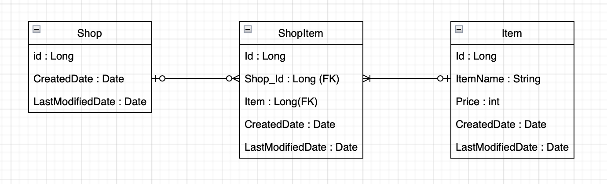

# JPA - 연관관계 OneToMany



```java
@Getter
@EntityListeners(AuditingEntityListener.class)
@MappedSuperclass
public abstract class BaseEntity {

    @CreatedDate
    @Column(name = "CREATEDDATE", updatable = false)
    private LocalDateTime createdDate;

    @LastModifiedDate
    @Column(name = "LASTMODIFIEDDATE")
    private LocalDateTime lastModifiedDate;
}
```

```java
@Entity
@AllArgsConstructor
@NoArgsConstructor
@Builder
public class Item extends BaseEntity {

    @Id @GeneratedValue(strategy = GenerationType.IDENTITY)
    @Column(name = "ITEM_ID")
    private Long id;

    private String itemName;

    private int price;

    public Item(String itemName, int price) {
        this.itemName = itemName;
        this.price = price;
    }
}
```

## 1 : N 연관관계 매핑하기

- @OneToMany
  - Entity 간의 1:N 연관관계를 명시한다.
- cascade 속성을 이용해 Shop Entity 와 ShopItem Entity 가 함께 관리될 수 있도록 한다.

```java
@Entity
@AllArgsConstructor
@NoArgsConstructor
@Builder
@Setter
public class Shop extends BaseEntity {

    @Id @GeneratedValue(strategy = GenerationType.IDENTITY)
    private Long id;

    @OneToMany(mappedBy = "shop", cascade = CascadeType.ALL)
    private List<ShopItem> shopItems = new ArrayList<>();

    public void addShopItem(ShopItem shopItem) {
        shopItem.setShop(this);
        this.shopItems.add(shopItem);
    }

    public void addShopItems(List<ShopItem> shopItems){
        shopItems.forEach((item) -> {
            item.setShop(this);
            this.shopItems.add(item);
        });
    }
}
```

## N : 1 연관관계 매핑하기

- @ManyToOne
  - Entity 간의 N:1 연관관계를 명시해준다.
- @JoinColumn
  - Foreign Key(외래키) 를 Mapping 할때 사용한다.

```java
@Entity
@NoArgsConstructor
@AllArgsConstructor
@Builder
@Getter
@Setter
public class ShopItem extends BaseEntity {

    @Id @GeneratedValue(strategy = GenerationType.IDENTITY)
    private Long id;

    @ManyToOne
    @JoinColumn(name = "ITEM_ID")
    private Item item;

    @ManyToOne
    @JoinColumn(name = "SHOP_ID")
    private Shop shop;
}
```